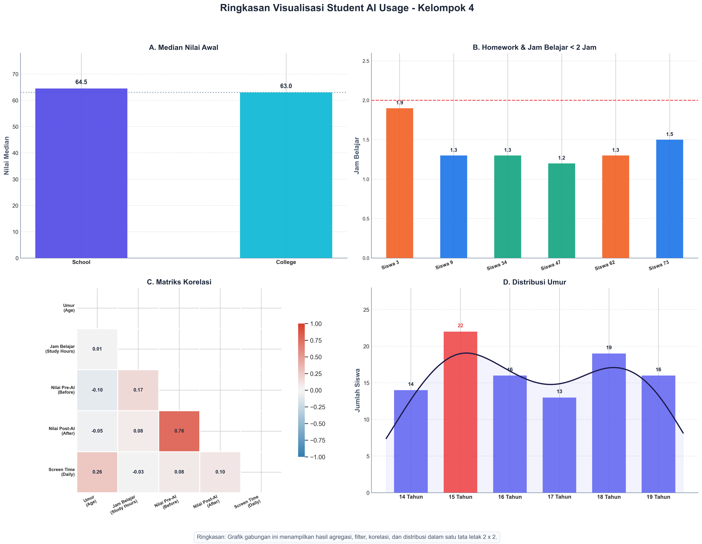

# Analisis Student AI Usage - Kelompok 4

Repository ini berisi hasil pengerjaan post test Praktikum Algoritma dan Pemrograman 2026 untuk Kelas F, Kelompok 4. Dataset yang digunakan adalah `Student AI Usage`, dengan fokus analisis pada hubungan penggunaan AI, jam belajar, nilai akademik, screen time, dan umur responden.

## Isi Repository

```txt
.
├── README.md
├── post_test_kelompok_4.ipynb
├── requirements.txt
├── caption_infografis_kelompok_4.txt
├── data/
│   └── Kelas F_Student AI Usage.csv
└── hasil_kelompok_4/
    ├── 01_kategori_a_median_grades_before.png
    ├── 02_kategori_b_homework_under_2_hours.png
    ├── 03_kategori_c_correlation_heatmap.png
    ├── 04_kategori_d_age_distribution.png
    └── 05_gabungan_2x2.png
```

## Penjelasan File

`post_test_kelompok_4.ipynb` adalah program utama sesuai ketentuan format file `.ipynb`. Notebook ini bersifat self-contained, sehingga seluruh kode analisis berada langsung di dalam notebook tanpa bergantung pada file `.py` terpisah. Setiap kategori dikerjakan pada block code masing-masing, lalu block code terakhir membuat grafik gabungan 2 x 2. Gaya visual grafik mengikuti versi desain dari file referensi `AI_USAGE - Copy/post_test_kelompok_4.py`.

`data/Kelas F_Student AI Usage.csv` adalah dataset utama yang digunakan dalam analisis. Dataset berisi 100 data responden dengan kolom umur, jenjang pendidikan, jam belajar, status penggunaan AI, tools AI, tujuan penggunaan AI, nilai sebelum AI, nilai setelah AI, dan screen time harian.

`hasil_kelompok_4/` adalah folder output yang berisi gambar hasil visualisasi. Semua gambar di folder ini dihasilkan langsung dari notebook.

`caption_infografis_kelompok_4.txt` berisi caption atau insight singkat untuk membantu menjelaskan masing-masing grafik pada infografis.

`requirements.txt` berisi daftar library Python yang diperlukan untuk menjalankan notebook, termasuk `scipy` untuk menampilkan KDE pada grafik distribusi umur.

## Soal Kelompok 4

Kelompok 4 mengerjakan 4 kategori dan 1 grafik gabungan berikut:

1. Kategori A: Menentukan median `grades_before_ai` berdasarkan `education_level`, lalu menampilkan hasilnya dalam Bar Chart.
2. Kategori B: Mencari siswa yang menggunakan AI untuk `Homework` dengan waktu belajar mandiri kurang dari 2 jam, lalu menampilkan hasilnya dalam Bar Chart.
3. Kategori C: Menghitung matriks korelasi antar kolom numerik, lalu menampilkan hasilnya dalam Heatmap.
4. Kategori D: Menampilkan distribusi umur siswa dalam Histogram atau grafik distribusi frekuensi.
5. Grafik gabungan: Menggabungkan Grafik A-D dalam satu layout 2 x 2 menggunakan `plt.subplots(2, 2, figsize=(...))` dan pendekatan objek `ax=axes[x, y]`.

## Hasil Visualisasi

### 1. Kategori A - Median Nilai Awal Berdasarkan Jenjang Pendidikan


Grafik ini menunjukkan median nilai awal sebelum penggunaan AI berdasarkan jenjang pendidikan. Median nilai siswa `school` adalah 64.5, sedangkan `college` adalah 63.0. Selisihnya kecil, sehingga kemampuan awal kedua kelompok dapat dianggap relatif seimbang.

### 2. Kategori B - Pengguna AI untuk Homework dengan Jam Belajar < 2 Jam


Grafik ini menampilkan siswa yang menggunakan AI untuk membantu mengerjakan homework dengan waktu belajar mandiri kurang dari 2 jam per hari. Terdapat 6 siswa yang memenuhi kriteria ini, dan seluruhnya mengalami peningkatan nilai setelah menggunakan AI.

### 3. Kategori C - Heatmap Korelasi Kolom Numerik


Heatmap ini menunjukkan hubungan antar variabel numerik, yaitu umur, jam belajar, nilai sebelum AI, nilai setelah AI, dan screen time harian. Korelasi terkuat terlihat antara nilai sebelum AI dan nilai setelah AI, dengan nilai korelasi sekitar 0.76.

### 4. Kategori D - Distribusi Umur Siswa


Grafik ini menunjukkan sebaran umur responden. Umur responden berada pada rentang 14 sampai 19 tahun, dengan jumlah responden terbanyak pada usia 15 tahun.

### 5. Grafik Gabungan 2 x 2



Grafik ini menggabungkan seluruh visualisasi kategori A-D ke dalam satu kanvas berukuran 2 x 2. Output ini dibuat untuk memenuhi ketentuan pengolahan data yang meminta grafik individu digabungkan menggunakan `plt.subplots(2, 2, figsize=(...))`.

## Cara Menjalankan Notebook

Pastikan Python 3 sudah tersedia, lalu jalankan perintah berikut dari root repository jika ingin membuat environment baru:

```bash
python3 -m venv .venv
source .venv/bin/activate
pip install -r requirements.txt
jupyter notebook post_test_kelompok_4.ipynb
```

Jika ingin menjalankan notebook langsung dari terminal dan membuat ulang semua gambar output, gunakan:

```bash
python -m nbconvert --to notebook --execute post_test_kelompok_4.ipynb --inplace
```

Setelah notebook dijalankan, gambar akan dibuat ulang di folder:

```txt
hasil_kelompok_4/
```

File notebook utama yang perlu dibuka atau dikumpulkan adalah:

```txt
post_test_kelompok_4.ipynb
```

## Ringkasan Insight

Analisis menunjukkan bahwa nilai awal siswa pada jenjang `school` dan `college` relatif mirip. Pada kelompok siswa yang menggunakan AI untuk homework dengan jam belajar rendah, seluruh siswa mengalami peningkatan nilai. Korelasi paling kuat ditemukan antara nilai sebelum dan sesudah penggunaan AI, sedangkan variabel seperti screen time dan durasi belajar memiliki korelasi yang lebih lemah terhadap nilai akademik.
